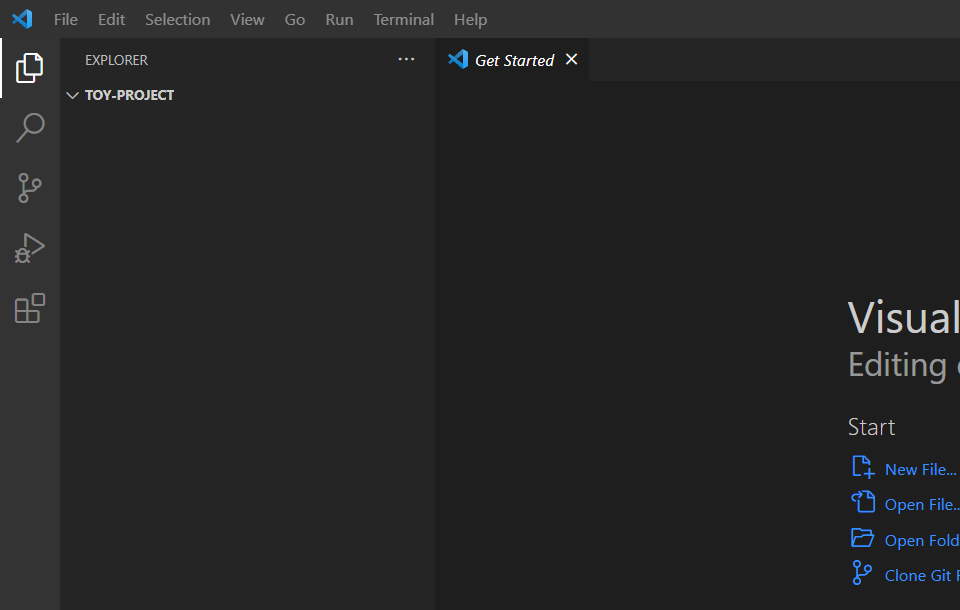
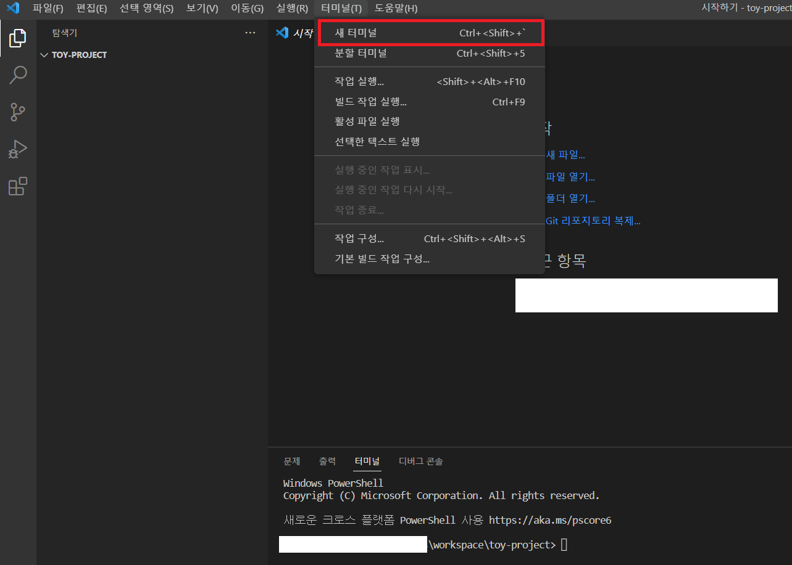
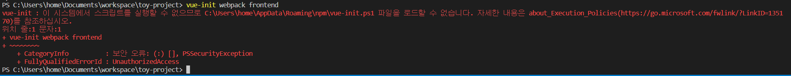
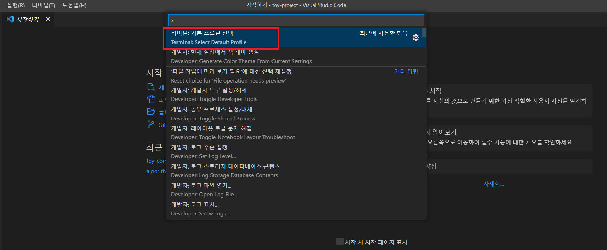
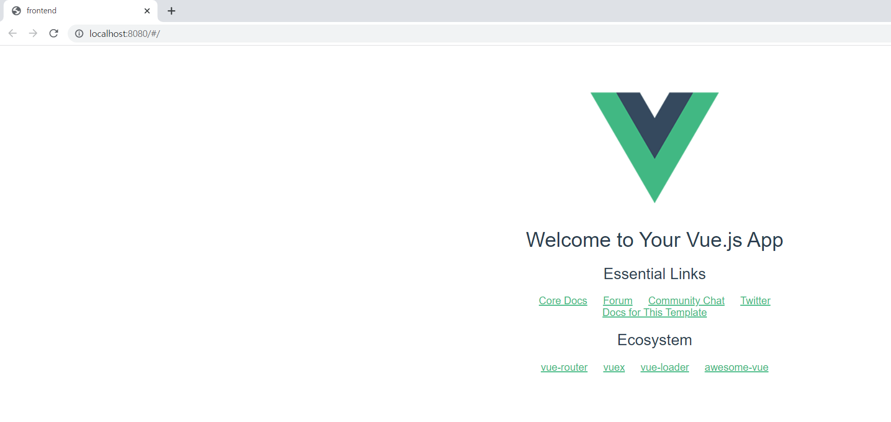
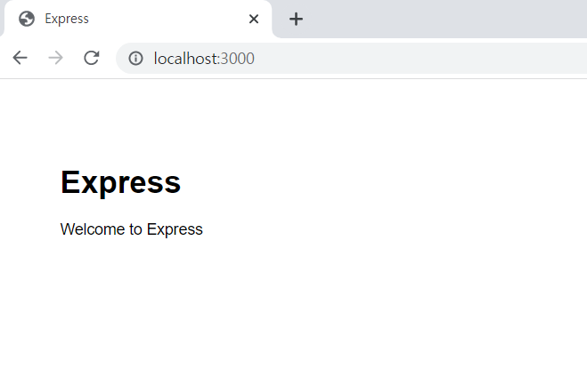

## - 만들면서 배우는 웹#1 -

## 들어가며
앞으로 연재할 포스팅에서는 Node.js와 Vue.js 를 사용하여 간단한 게시판을 만들어 보고자 합니다.

## 프로젝트 생성하기
이번 프로젝트에서 사용하는 소스 코드 편집기로 [Visual Studio Code](https://code.visualstudio.com/)(이하 VS Code)를 사용하겠습니다.

Node.js는 https://nodejs.org/ko/ 에서 LTS 버전으로 다운받습니다. 포스팅을 작성하는 현재 *16.17.1 LTS* 버전을 사용하겠습니다.

### 프로젝트 초기 셋팅
먼저 원하는 경로에 프로젝트를 위한 폴더를 생성합니다. VS Code를 실행시키고 [파일 > 폴더 열기] 메뉴를 클릭하여 앞서 생성한 폴더 경로를 선택합니다.



이후 [터미널 -> 새 터미널 열기] 메뉴를 클릭하여 터미널을 실행합니다.



이후 터미널에 다음 명령어를 순서대로 실행합니다.

```
npm init -y

npm install -g vue-cli

vue-init webpack frontend
# Install vue-router? (Y/n)  ==> y
# Use ESLint to lint your code? (Y/n) ==> y
# Pick an ESLint preset ==> Standard
# Set up unit tests (Y/n) ==> n
# Setup e2e tests with Nightwatch? (Y/n) ==> n
# Should we run `npm install` for you after the project has been created? ==> npm

##### Front End Setting End #####

npm install -g express-generator

express --view=ejs backend
cd backend
npm install
```

vue-cli를 설치한 후 vue-init 명령어 실행시 다음과 같은 오류가 발생하는 경우는 vs code에서 기본 terminal이 powerShell로 잡혀있기 때문이므로
기본 터미널을 변경해 주거나 `vue-cli.cmd webpack frontend` 로 명령어를 입력합니다.



기본 터미널 변경 방법은 ctrl + shift + p 를 누르면 다음과 같은 창이 뜨는데 검색창에 Terminal: Select Default Profile을 선택한 후 기본 터미널을 변경한 후 터미널을 재실행 하여 진행하면 됩니다.



위 명령어를 모두 실행하고 나면 다음과 같은 폴더 구조를 가지게 됩니다.

```
├── backend
│   └── bin           # 실행 가능한 파일 모음
|       └── www       # Express 서버 실행 파일
│   └── data          # mock 데이터 json 파일 모음
│   └── node_modules  # npm 으로 설치된 서드파티 라이브러리 모음
│   └── public        # 서버에서 사용하는 정적 리소스 파일 모음. frontend 폴더에서 build 실행시 이쪽으로 떨어짐
│   └── routes        # 사용자가 접속한 URL 처리
│   └── views         # 사용 안함
│   └── app.js        # 미들웨어 연결. routes에서 추가한 파일 연결 필요
│   └── package.json  # 프로젝트 정보 정의, 의존 패키지 버전 정보 명시 파일
├── frontend
│   └── build         # webpack 빌드 관련 설정 파일 모음
│   └── config        # 프로젝트에서 사용되는 설정 파일 모음
│   └── dist          # 배포 버전의 Vue 어플리케이션 파일이 모여 있는곳. 현재 사용 안함. backend/public 밑으로 이전
│   └── node_modules  # npm 으로 설치된 서드파티 라이브러리 모음
│   └── src           # 실제 작업해야 하는 소스 코드 모음
│       └── assets      # 어플리케이션에서 사용하는 이미지, 동영상 등을 모음
│       └── components  # Vue 컴포넌트 모음
│       └── router      # Vue Router 설정
│       └── App.vue     # 최상위 컴포넌트
│       └── main.js     # 가장 먼저 실행되는 javascript 파일. Vue 인스턴스 생성
|   └── static
|   └── index.html    # 어플리케이션 최상위 html 파일
|   └── package.jso   # 프로젝트 정보 정의, 의존 패키지 버전 정보 명시 파일
```

프로젝트 구조가 셋팅된 것을 확인 한 후 터미널에서 아래 명령어를 실행하여 정상적으로 구동되는지 확인합니다.
`frontend`와 `backend` 프로젝트 개별로 구동해야 하므로 VS Code 터미널을 하나 더 추가합니다.
터미널 추가는 VS Code 우측 하단에 `+` 버튼을 클릭하면 2개의 터미널을 사용할 수 있습니다.

```
# frontend 구동 방법
cd frontend
npm run dev
```

frontend 프로젝트 구동후 브라우저에서 `http://localhost:8080` 으로 접속했을 때 아래와 같은 화면이 뜨면 정상입니다.



```
# backend 구동 방법
cd backend
npm run start
```

backend 프로젝트 구동후 브라우저에서 `http://localhost:3000` 으로 접속했을 때 아래와 같은 화면이 뜨면 정상입니다.



### Node.js란 무엇인가요?

Javascript는 웹 브라우저 기반으로 동작하는 스크립트 언어입니다. 
Client 개발에만 사용하던 Javascript를 Node.js 라는 개념이 등장하면서 서버에서 구동 가능한 Javascript 런타임 환경을 제공하게 되었습니다.
하나의 언어로 Client-Server 모델을 모두 구현 가능하여 Client만 개발하던 분들도 동일한 문법으로 빠르게 Server 영역까지 개발을 할 수 있습니다.

Node.js는 *Chrome V8 Javascript 엔진으로 빌드 된 Javascript 런타임* 입니다. 
V8 이란 Google에서 제작한 고성능의 오픈소스 Javascript 전용 WebAssembly 엔진으로 C++로 작성되었습니다. 
Javascript 코드를 ByteCode로 컴파일하고 실행하는 방식을 사용합니다.
이러한 V8 엔진으로 웹서버와 같이 확장성 있는 시스템 개발하는데 사용합니다.

이와 더불어 libuv라는 라이브러리를 사용하여 이벤트 기반 Non-blocking I/O 모델을 구현하고 있습니다.

Node.js는 Non-blocking I/O와 단일 스레드 이벤트 루프를 통해 더 적은 리소스로 높은 처리 성능을 가집니다. 
Non-blocking I/O는 사용자로부터 요청된 I/O 작업을 처리 완료 여부에 상관없이 즉시 응답을 받는 모델입니다.
I/O는 주로 libuv가 지원하는 시스템 디스크나 네트워크와 상호작용하는 것을 가리킵니다.
이벤트 루프에서는 이벤트를 위해 등록된 Javascript 콜백을 실행하고 네트워크 I/O와 같은 비동기, Non-blocking 요청들을 처리합니다.

Node.js로 코드를 작성할 때 주의할 점은 동기적으로 동작하는 비싼 작업을 주의해야 합니다. 
대표적으로 Node.js 코어 모듈에서 지원하는 암호화, 압축, 파일 시스템, 자식 프로세스가 있습니다. 
이벤트 루프는 단일 스레드로 동작하고 있기에 연산이 오래 걸려 blocking 상태에 있으면 다음에 들어오는 요청이 처리되지 않습니다.

Blocking 되는 작업에 주의하여 개발한다면 적은 리소스로 높은 성능을 내는 서버를 간편하게 개발 할 수 있다는 점에서 Node.js는 가벼운 웹 서버 개발에 좋은 선택이 될 수 있습니다.

### NPM 이란 무엇인가요?

프로젝트 셋팅과 구동을 할 때 `npm`으로 시작하는 명령어들을 보셨을 겁니다. npm이란 Node.js를 위한 Package Manager 입니다.
프로젝트에 사용할 패키지들은 `package.json` 파일에서 관리하고 있습니다. 앞서 사용한 명령어들을 조금 살펴보도록 하겠습니다.

```
npm init
- npm 사용이 가능한 초기 환경을 구성해 줍니다.
- 패키지 명, 버전, 설명, entry point(시작 위치), Author, license 등을 입력하여 package.json 파일을 생성합니다.

npm install '패키지명'
- 원하는 패키지를 설치하는데 사용합니다. 옵션이 없을 경우 프로젝트 내 node_modules 폴더에 다운로드 됩니다.
- -D 옵션을 추가하면 package.json에서 dev-dependencies에 기록되며 개발할 때만 사용하는 패키지를 다운로드할 떄 사용합니다.
- -g 옵션을 추가하면 해당 프로젝트 뿐만 아니라 전역으로 사용 가능한 패키지를 다운로드 합니다.

npm run '명령'
- package.json 내의 scripts에 지정된 명령어를 실행할 때 사용합니다.
```

### Vue.js 란 무엇인가요?

Vue.js는 사용자 인터페이스 개발을 위한 Javascript 프레임워크 입니다. 
표준 HTML, CSS, Javasciript로 개발이 가능하며 선언적, 컴포넌트 기반의 프로그래밍 모델을 가지고 있어 더 효출적인 개발이 가능합니다.
표준 HTML 문법으로 Javascript 상태를 표현하면 변경된 값을 DOM에 자동으로 랜더링 해줍니다.

아래 예시는 Vue.js 공식 홈페이지에 있는 예제 입니다.
```javascript
import { createApp } from 'vue'

createApp({
  data() {
    return {
      count: 0
    }
  }
}).mount('#app')
```
```html
<div id="app">
  <button @click="count++">
    Count is: {{ count }}
  </button>
</div>
```

위의 결과에서 button 태그에 `@click="명령"`은 click 이벤트가 트리거 될 때 호출되는 method로 `v-on:click="명령"`이라는 Vue.js의 *디렉티브*를 줄여서 표현한 것입니다.
디렉티브는 `v-` 접두어가 붙은 Vue.js에서 제공하는 특수 속성을 의미하며 DOM에 특수한 반응형 동작을 합니다. 
따라서 button을 클릭할 때마다 `count` 값이 증가되며 `{{ count }}` 에 선언된 count 값이 최신 상태를 유지합니다.

컴포넌트 기반 프로그래밍 모델의 개념은 작고 독립적이며 재사용할 수 있는 컴포넌트로 어플리케이션을 구축할 수 있게 해주는 추상적 개념을 말합니다.


다음 코드에서 `todo-item`이라는 이름으로 컴포넌트를 등록합니다.
```javascript
// 뷰 어플리케이션을 생성합니다.
const app = Vue.createApp(...)

// todo-item 란 이름의 새로운 컴포넌트를 선언합니다.
app.component('todo-item', {
  template: `<li>할일이 있어요</li>`
})

// 어플리케이션을 마운트 합니다.
app.mount(...)
```

그러면 아래와 같이 `todo-item`이라는 컴포넌트를 사용할 수 있습니다.
```html
<ol>
  <!-- todo-item 컴포넌트의 인스턴스를 만듭니다.  -->
  <todo-item></todo-item>
</ol>
```

이렇게 작은 단위의 컴포넌트를 만들어 전체 애플리케이션에서 재사용성을 높일 수 있습니다.

### 마무리

이번 포스팅에서는 Node.js, Vue.js 기반의 frontend, backend 프로젝트 초기 셋팅을 진행하였습니다.
Javascript라는 하나의 언어로 서버 - 클라이언트 개발을 동시에 진행 할 수 있어 포스팅을 연재하며 웹 개발을 쉽게 접할 수 있습니다.

다음 포스팅에서는 게시판을 만들기 위한 화면 구성을 해보도록 하겠습니다.